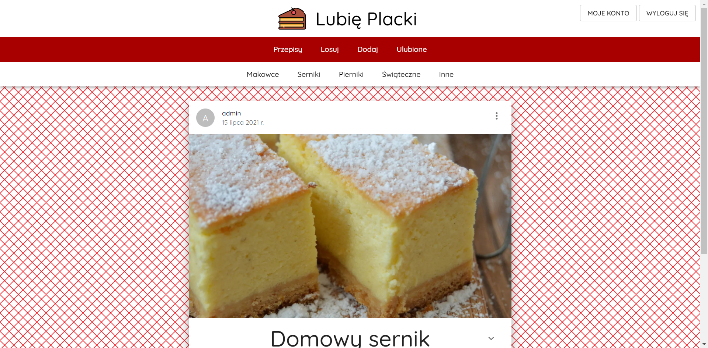
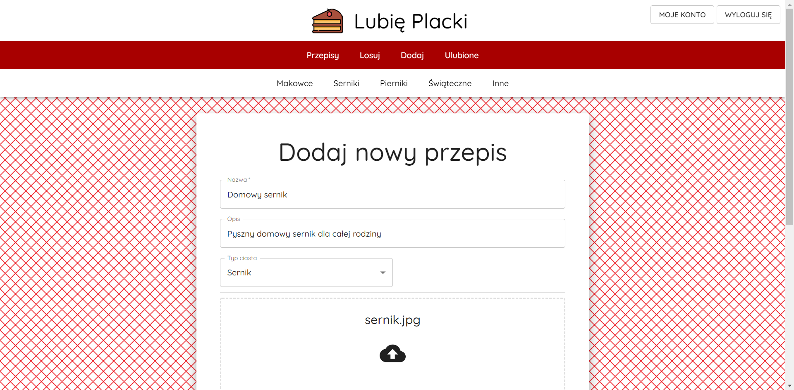
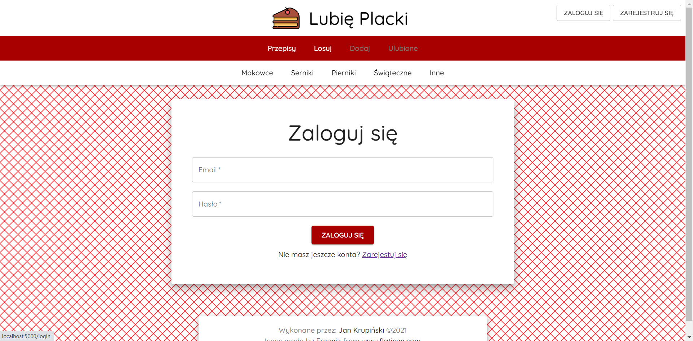

# Lubię Placki

Website dedicated to sharing recipes - frontend part

## Website

https://lubie-placki-web.herokuapp.com/

## Installation

Download or clone repository

Add .env file

```
REACT_APP_API_URL=...
REACT_APP_TOKEN_KEY=...
PORT=...
```

Run

```bash
# installing dependances
$ yarn install
```

## Running the app

```bash
# development
$ yarn start
```

## Views

 

